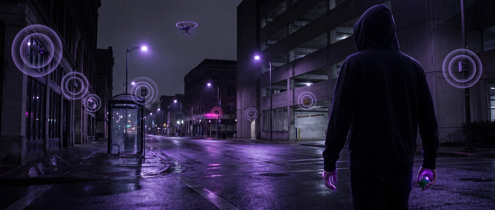
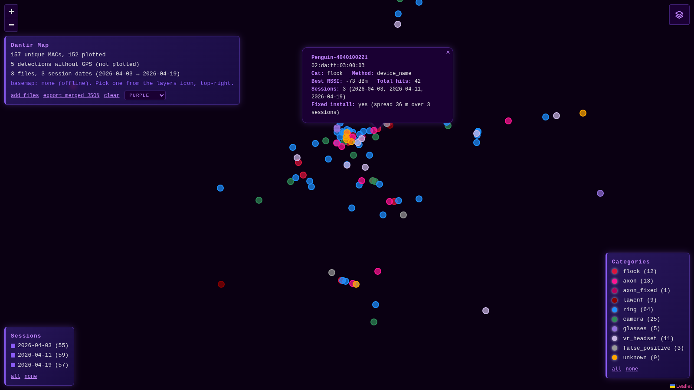

# Dantir — Surveillance Counter-Watcher

> *Sindarin:* **dan** (against / back) + **tir** (to watch) = *"counter-watcher."*



Dantir is a pocket-sized **BLE + WiFi surveillance-detection device** for the
Seeed XIAO ESP32-S3. It passively listens for the radio signatures of
surveillance hardware around you — Flock Safety ALPR cameras, Ring/Amazon
cameras, recording smart glasses, Bluetooth trackers, gunshot-detector nodes,
and law-enforcement gear — then alerts you with audio, light, and a live web
dashboard with a proximity radar.

It only **detects and documents**. It does not jam, spoof, or interfere with
anything. Awareness is the point: you can't push back against what you can't
see.

## What's new

- **2026-09-20 · Confidence is a field, not a comment.** Every detection now carries
  `conf: high|low`. A device's own name, manufacturer ID, GATT UUID or SoftAP SSID is
  `high`; any bare OUI-prefix match is `low`. Low-confidence hits are logged and exported
  but sound as a single dit and stay off the map by default. Flock cameras are also caught
  by their SoftAP name (`Flock-` + six hex, or bare `Flock`), which needs no OUI at all.
  Three new categories: `flock_candidate` (a lead to go look at), `false_positive` and
  `known_benign` (identified, not a threat). Your field-cleared device list moved to a
  gitignored `src/known_benign_local.h`. Two Espressif OUIs that had crept into the
  Flock table were removed; every prefix is now checked against the IEEE registry.
  Hardening from a pre-push audit: radio-supplied names are sanitized on every path
  (JSON, CSV, KML, dashboard), cleared devices stay cleared across nameless re-sightings,
  and the category field was widened so the new names no longer truncate.
- **2026-09-19 · Map your exports.** `tools/map/` is a static page you open from disk: drop
  the dashboard's JSON/KML/CSV exports on it and see them on a map with category and
  session-date filters, the dashboard's three themes, and a fixed-install test (same MAC
  on 2+ dates within 150 m). Nothing is uploaded; the basemap is off until you pick one.
  One-file download: [`tools/map/dantir-map.standalone.html`](tools/map/dantir-map.standalone.html).
  Details in [Map your exports](#map-your-exports).
- **2026-09-19 · deflock.me is now deflock.org** in the credits.

---

## Credits & Lineage

Dantir stands on the shoulders of others' work. Full respect and thanks to:

- **[Colonel Panic](https://colonelpanic.tech/) — [OUI Spy Unified Blue](https://github.com/colonelpanichacks/oui-spy-unified-blue)**
  Dantir is a fork of OUI Spy Unified Blue's *Flock-You* mode. The detection
  engine, session persistence, GPS handling, export pipeline, and dashboard
  foundations all originate there. If you want a polished, pre-built detector,
  buy one from Colonel Panic — support the upstream project.
- **[wgreenberg / flock-you](https://github.com/wgreenberg/flock-you)** — BLE
  detection research and signature work that informs how Flock devices are
  identified.
- **[deflock.org](https://deflock.org/)** — community-sourced surveillance device
  signatures.

Dantir's changes over upstream: standalone single-mode firmware (no BOOT-button
mode dance), added WiFi promiscuous detection (Ring/Blink), expanded BLE
manufacturer-ID and category coverage, Morse-code category alerts, a proximity
radar dashboard, and peak-RSSI GPS tracking.

---

## What it detects

Dantir uses **nine detection methods** across BLE and WiFi. Each one sets the
detection's **confidence**: `high` means the device identified itself, `low` means
only a vendor prefix matched.

| Method | Radio | Confidence | How it matches |
|--------|-------|:----------:|----------------|
| `device_name` | BLE | high | Advertised name patterns (Flock, Penguin, Pigvision, Ring, Ray-Ban…) |
| `ble_mfr_id` | BLE | high | Bluetooth manufacturer company IDs |
| `raven_uuid` | BLE | high | Raven gunshot-detector service UUIDs (+ firmware-version estimate) |
| `flock_uuid` | BLE | high | Flock accessory GATT service UUIDs |
| `wifi_ssid` | WiFi | high | Beacon SSID `Flock-` + six hex (the camera's SoftAP name) or bare `Flock` |
| `name_pattern` | BLE | low | A hostname pattern Flock has shipped on (`DBC350…`) with nothing else to go on; yields `flock_candidate` |
| `mac_prefix` | BLE | low | MAC OUI against the prefix set |
| `wifi_probe` | WiFi | low | Probe-request source MAC OUI (promiscuous mode) |
| `wifi_beacon` | WiFi | low | Beacon-frame source MAC OUI (promiscuous mode) |

Detections are grouped into **thirteen categories**. High-confidence hits beep the
category's Morse letter; low-confidence hits beep one dit whatever the category, so a
shared vendor prefix can never sound like a confirmed camera:

| Category | Morse | What it covers |
|----------|:-----:|----------------|
| `flock`      | ··-· (F) | Flock Safety / ALPR cameras, Penguin, Pigvision |
| `axon`       | ·- (A)   | Axon ALPR cameras (the vendor replacing Flock in some cities) |
| `glasses`    | --· (G)  | Camera-equipped smart glasses (Ray-Ban Meta, Oakley, Snap) |
| `vr_headset` | · (E)    | VR headsets (Quest/Oculus) — benign; logged with a quiet blip, not a threat alert |
| `tracker`    | - (T)    | Bluetooth trackers (Tile, etc.) |
| `lawenf`     | ·-·· (L) | Law-enforcement gear (TASER/Axon body-cams, Motorola Solutions) |
| `ring`       | ·-· (R)  | Ring / Blink / Amazon cameras |
| `camera`     | ··· (S)  | Other surveillance cameras (Hikvision, Arlo, Wyze) |
| `raven`      | ···- (V) | Raven gunshot-detector nodes |
| `wifi`       | ·-- (W)  | Generic WiFi-side detections |
| `flock_candidate` | --·- (Q) | A lead worth a look, not an identification (today only produced by `name_pattern`, so it sounds as one dit under the low-confidence rule) |
| `false_positive` | ·· (I) | A prefix hit whose name proves it is something else (a Hue lamp, a Wyze lock, an OBD-II dongle) |
| `known_benign` | ·· (I) | On your own field-cleared list (see [Key configuration](#key-configuration)) |

> **Detection is signature-based, not proof.** Every prefix in the table is a
> module-vendor block (Liteon, Silicon Labs, Samsung…), never a Flock-specific
> IEEE assignment, so an OUI hit is a lead and nothing more; that is exactly what
> the `low` confidence label says, in the data rather than in a comment. Confirm
> visually before drawing conclusions. Every prefix is checked against the IEEE
> registry before adoption: two Espressif blocks that a community list had labelled
> Raven and Flock would have flagged every other ESP32 in range, and were rejected.
> `false_positive` and `known_benign` are never geo-logged, and neither is
> `unknown` or `vr_headset`: a detection you cannot name, or one you have cleared,
> is counted but its coordinates are not written anywhere.

---

## Features

- **Dual-radio scanning** — BLE active scan + WiFi promiscuous capture running
  alongside the dashboard access point.
- **Morse-code alerts** — each category beeps its letter, so you can ID a hit
  by ear without looking.
- **Foxhunter / proximity mode** — once a device is in range, a heartbeat beep
  every 10 s helps you locate it; clears after 30 s with no new sightings.
- **NeoPixel feedback** — purple breathing when idle, red/pink flash on
  detection, dim heartbeat glow while a device is nearby.
- **Live web dashboard** — proximity radar, live detection cards, stats, and
  three themes (Purple, Tactical, Ithildin).
- **GPS tagging** — hardware GNSS (Seeed L76K) with phone-browser geolocation
  fallback; tracks both first-seen and **peak-RSSI (closest-approach)** position.
- **Exports** — download a session as JSON, CSV, or KML (Google Earth).
- **Session persistence** — detections survive reboots; the prior session is
  auto-backed up to onboard flash.
- **Optional battery monitoring** — LiPo percentage via a voltage divider, or
  uptime display if the ADC is disabled.

---

## Hardware

### Bill of materials (per unit)

| Part | Notes | Approx. |
|------|-------|---------|
| Seeed XIAO ESP32-S3 (N8R8) | Main board; needs PSRAM variant | ~$9 |
| Passive buzzer | Audio + Morse alerts | ~$1 |
| WS2812 / NeoPixel | Status LED | ~$1 |
| Seeed L76K GNSS module | *Optional* — GPS tagging | ~$10 |
| U.FL→SMA pigtail + 2.4 GHz antenna | *Optional* — extends range | ~$6 |

> For external antenna use, the XIAO's RF switch 0-ohm resistor must be moved to
> the U.FL pad. The onboard PCB antenna works fine for getting started.

### Pin map

| Function | GPIO | XIAO pin |
|----------|:----:|:--------:|
| Buzzer | 3 | — |
| NeoPixel | 4 | — |
| GPS RX | 44 | D7 |
| GPS TX | 43 | D6 |
| Battery ADC *(optional, `-1` = off)* | 1 | A0 / D0 |

---

## Build & flash

Dantir is a [PlatformIO](https://platformio.org/) project (no Arduino IDE
sketch juggling required).

```bash
git clone https://github.com/rpriven/dantir.git
cd dantir

# Build
pio run

# Flash + open serial monitor (auto-detects the XIAO on USB)
pio run --target upload
pio device monitor
```

Target environment: `seeed_xiao_esp32s3` (defined in `platformio.ini`).
Libraries are pulled automatically: NimBLE-Arduino, ESP Async WebServer,
Adafruit NeoPixel, ArduinoJson, and TinyGPSPlus.

If `pio` isn't installed: `pip install platformio` (or use the PlatformIO IDE
extension for VS Code).

---

## Usage

1. **Power on.** Dantir plays a boot "crow call" and starts scanning
   immediately — no mode selection needed.
2. **Connect to the dashboard.** Join the WiFi access point:
   - **SSID:** `dantir`  •  **Password:** `dantir123`
   - Open **`http://192.168.4.1`** in a browser.

   > ⚠️ **Change the defaults before any real use.** The stock AP credentials
   > (`dantir` / `dantir123`) are published here and in the source — anyone
   > within WiFi range of a device on stock firmware can open your live
   > detection feed and GPS position. Edit `FY_AP_SSID` / `FY_AP_PASS` in
   > `src/main.cpp` and re-flash before you take it out.
3. **(Optional) share phone GPS.** The dashboard can push your phone's
   geolocation to the device as a fallback when no hardware GNSS fix is present.
   Hardware GPS always takes priority when available.
4. **Walk.** Watch the radar and detection cards populate. Listen for the
   Morse-letter beeps to ID categories by ear.
5. **Export.** Download the session as JSON / CSV / KML, or clear it to start
   fresh (the cleared session is backed up automatically).

### Web API

The onboard server (port 80) exposes a small JSON API used by the dashboard:

| Endpoint | Purpose |
|----------|---------|
| `GET /` | Dashboard UI |
| `GET /api/detections` | Live detection list |
| `GET /api/stats` | Counts, GPS status, battery/uptime |
| `GET /api/gps?lat=&lon=&acc=` | Push phone GPS to the device |
| `GET /api/patterns` | Full signature database (MACs, names, MFR IDs, UUIDs) |
| `GET /api/export/{json,csv,kml}` | Download current session |
| `GET /api/history` · `/api/history/{json,kml}` | Prior session |
| `GET /api/clear` | Clear detections (backs up first) |

---

## Data & exports

Each detection records MAC, name, RSSI, detection method, category, confidence
(`conf`: `high` or `low`), first/last seen, re-sighting count, Raven flag +
firmware estimate, and **two** GPS fixes: first-seen and peak-RSSI (closest
approach). A first-seen fix that was carried forward from an earlier reading is
flagged `gps_interp` so it is never mistaken for a live position. Exports:

- **JSON** — full structured record incl. `gps` and `best_gps` objects.
- **CSV** — flat table for spreadsheets/analysis; `confidence` is the last column.
- **KML** — placemarks for Google Earth; uses the peak-RSSI position when
  available for the most accurate location, and labels an interpolated pin as such.

Device names come off the radio and are attacker-controlled, so they are sanitized
on every path before they reach an export or the dashboard (quotes, backslashes,
angle brackets, ampersands and control bytes become `_`; a CSV name that starts
with `=`, `+`, `-` or `@` is prefixed so a spreadsheet will not evaluate it).

Sessions auto-save to onboard flash (SPIFFS) every ~15 s and are restored on
boot, so a power cycle won't lose your data.

---

## Map your exports



`tools/map/dantir-map.html` puts your exports on a map: open it in a browser and
drop the `.json` / `.kml` / `.csv` files from the dashboard onto it. Sessions
merge by MAC, categories are click-to-filter, and the basemap picker includes a
**None** option so the page makes zero network requests. Everything runs in the
tab; nothing is uploaded. Leaflet is vendored, so no CDN either.

To bake many sessions into one portable file:

```
bun tools/map/build-map.ts path/to/exports/ -o my-map.html
```

Details, formats, and the fixed-install test (same MAC on 2+ session dates within
150 m = pole-mounted, not a passing unit): [`tools/map/README.md`](tools/map/README.md).
Two synthetic sessions live in `tools/map/sample/` for a first try.


## Key configuration

Tunable `#define`s at the top of `src/main.cpp`:

| Setting | Default | Meaning |
|---------|:-------:|---------|
| `BLE_SCAN_DURATION` / `BLE_SCAN_INTERVAL` | 2 s / 3000 ms | BLE scan timing |
| `MAX_DETECTIONS` | 200 | Stored-detection capacity |
| `BATTERY_ADC_PIN` | `-1` | Set to a GPIO to enable battery monitoring |
| `BATTERY_FULL_V` / `BATTERY_EMPTY_V` | 4.2 V / 3.0 V | LiPo range |
| `FY_AP_SSID` / `FY_AP_PASS` | `dantir` / `dantir123` | Dashboard AP credentials |
| `FY_SAVE_INTERVAL` | 15000 ms | Session auto-save interval |

**Your field-cleared device list** lives outside the source: copy
`src/known_benign_local.h.example` to `src/known_benign_local.h` and add the MACs of
devices you physically checked and found harmless. They are counted, never alerted as
a threat, never geo-logged. The file is in `.gitignore` on purpose: a list of cleared
devices is a list of specific homes near where you drive, and one commit would publish
it. Without the file the firmware builds with an empty list.

---

## Responsible use

Dantir is a **defensive, educational, passive** tool. It receives radio signals
that devices already broadcast publicly — the same advertisements your phone
sees — and matches them against known signatures. It transmits nothing at the
targets and interferes with nothing.

You are responsible for using it lawfully in your jurisdiction. Detect, learn,
document — don't harass, stalk, or disrupt. The goal is to make an invisible
surveillance landscape visible, not to interfere with it.

**A note on the tracker category.** Detecting Bluetooth trackers (Tile,
AirTag-class devices) is a defensive, anti-stalking use — it helps someone find
a tracker another person has planted on their car or belongings. Dantir
identifies *device classes* by their public radio signatures; it is not built
to locate or follow a specific person, and we ask that you don't try to.

---

## License

[MIT](LICENSE) — Copyright (c) 2026 rpriven.
Based on **OUI Spy Unified Blue** by
[colonelpanichacks](https://github.com/colonelpanichacks/oui-spy-unified-blue).
